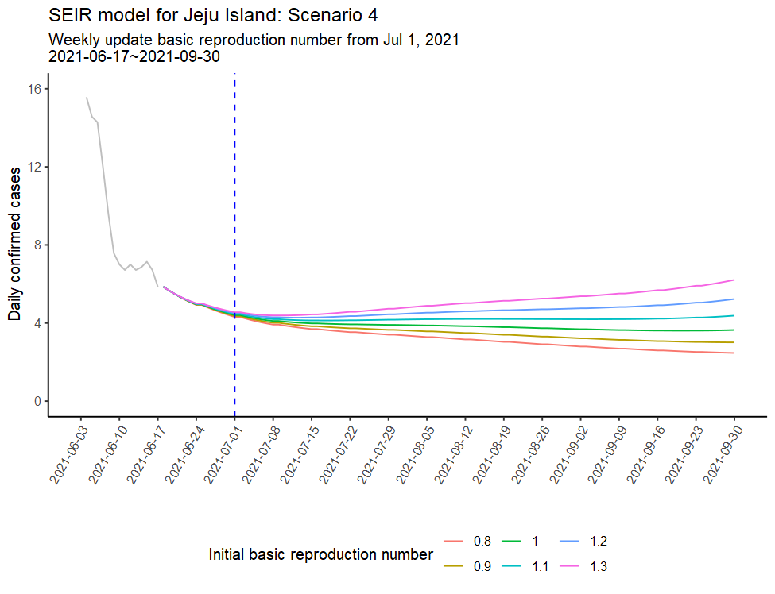

# COVID-19 projections using SEIR models with R
* Projecting the number of daily confirmed cases(SARS-CoV-2) in Jeju island using SEIR models
* Unfortunately, Due to business security, data cannot be provided
* Only R and Rmd code will be provided
* [Done] 2021. 06
* Jeju SEIR model flow chart

 
  

* The preview of the analysis results

 
  

